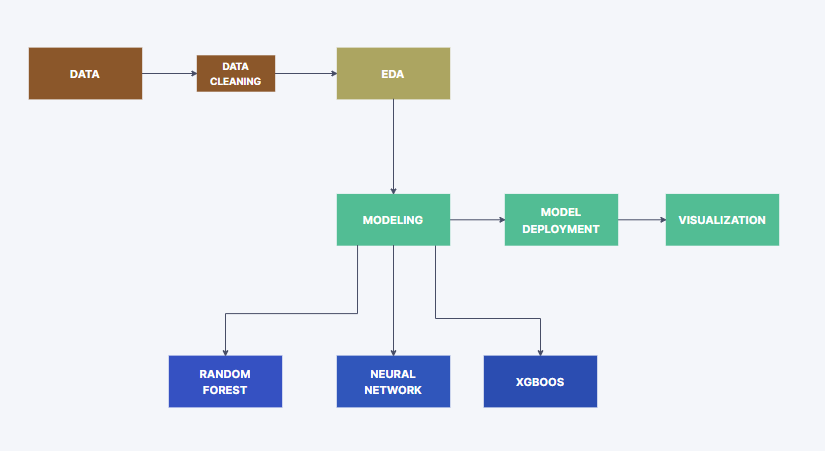

# Rossmann Pharmaceutical Store Sales

## Overview

Pharmaceutical Sales prediction
The finance department wishes to anticipate sales six weeks ahead of time in all of their stores across many cities.This project has developed an end-to-end solution that will offer the finance team's analysts with this projection.

## Data

The data team identified factors such as promotions, competition, school and state holidays, seasonality, and locality as necessary for predicting the sales across the various stores.

# Pipeline Design



## Install

```
git clone https://github.com/Melak2017/Pharmaceutical-Sales-Prediction-.git
pip install -r requirements.txt
```
