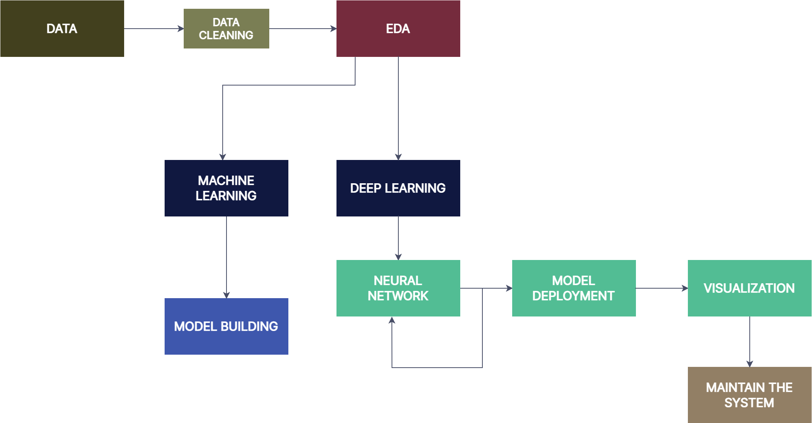

# Rossmann Pharmaceutical Store Sales

## Content

- [Overview](#overview)
- [Project Structure](#project-structure)
- [Dataset Description](#the-dataset-description)
- [The Dataset](#data)
- [Project Development Method](#project-development-method)
- [Dashboard](#dashboard)
- [Article](#article)
- [Install](#install)

---

## Overview

Pharmaceutical Sales prediction
The finance department wishes to anticipate sales six weeks ahead of time in all of their stores across many cities.This project has developed an end-to-end solution that will offer the finance team's analysts with this projection.

---

## Project Structure

### .dvc

used to track large files, models, dataset directories.

### .vscode

collection of folders that are opened in a VS Code window.

### dashboards

script and css files for dashboard building.

### data

`train.csv`: This is a dataset including sales information from Rossman locations. It provides sales data from 2013 to 2015.  
`test.csv` :This dataset contains tests to validate the performance model.

`store.csv` :Each store's data is stored in this dataset.

### ml_analysis_practice

a directory where pipline design found.

### mlruns/0

MLflow code to track and log work parameters and metrics.  
`meta.yaml` :default mlruns.

### models

All models that are trained are saved inside models folder

### notebooks

`data_exploration.ipynb` : Notesbook where exploratory data analysis performed.
`ml_preprocess.ipynb` : Cleaning and feature selection are conducted in this notebook for the building of machine learning models.Numerical data was rescaled, and categorical data was encoded.  
`lstm_sale_forecasting.ipynb` : Notebook where time series analysis is performed.
`Modelling_SalesPrediction.ipynb` :Notebook for machine learning model training

### screenshots

A sample screenshots of analysis result

### scripts

`clean_train_test_df.py`: a python script for cleaning pandas dataframes.
`data_preview.py`: a python script for selecting data from a pandas. dataframe
`data_loader.py`: a python script for loading csv and excel files to a dataframe.
`data_manipulation.py`: a python script for manipulating dataframes.  
`plots.py`: a python script for plotting dataframes.  
`logger_creator.py`: a python script that creates python based logger and helps user log different messages.  
`results.py`: a python script for collecting and pickling data.  
`ml_modeling.py`: a python script for for moedling

### tests

`test_data_preview.py` :Script for unit testing.

### root directory

`requirements.txt`: a text file lsiting the projet's dependancies  
`app.py`: entry file for the streamlit application  
`setup.py`: a configuration file for installing the scripts as a package  
`README.md`: Markdown text with a brief explanation of the project and the repository structure.

---

## Data

The data team identified factors such as promotions, competition, school and state holidays, seasonality, and locality as necessary for predicting the sales across the various stores.
Data can be found [here](https://drive.google.com/drive/folders/16rNg4_H6RkL9NmJfjra_fpBxX6ktI2ZH?usp=sharing).

---

## The Dataset Description

The dataset has 1017209 rows and 17 columns that represets features which explain behaviors of the target variable **Sales**.

- Id - an Id that represents a (Store, Date) duple within the test set
- Store - a unique Id for each store
- Sales - the turnover for any given day (this is what you are predicting)
- Customers - the number of customers on a given day
- Open - an indicator for whether the store was open: 0 = closed, 1 = open
- StateHoliday - indicates a state holiday. Normally all stores, with few exceptions, are closed on state holidays. Note that all schools are closed on public holidays and weekends. a = public holiday, b = Easter holiday, c = Christmas, 0 = None
- SchoolHoliday - indicates if the (Store, Date) was affected by the closure of public schools
- StoreType - differentiates between 4 different store models: a, b, c, d
- Assortment - describes an assortment level: a = basic, b = extra, c = extended
- CompetitionDistance - distance in meters to the nearest competitor store
- CompetitionOpenSince[Month/Year] - gives the approximate year and month of the time the nearest competitor was opened
- Promo - indicates whether a store is running a promo on that day
- Promo2 - Promo2 is a continuing and consecutive promotion for some stores: 0 = store is not participating, 1 = store is participating
- Promo2Since[Year/Week] - describes the year and calendar week when the store started participating in Promo2
- PromoInterval - describes the consecutive intervals Promo2 is started, naming the months the promotion is started anew. E.g. "Feb,May,Aug,Nov" means each round starts in February, May, August, November of any given year for that store.

---

## Project Development Method

- Business Understanding;
- Data Collection;
- Data Cleaning;
- Exploratory Data Analysis (EDA);
- Data Preparation;
- Machine Learning Modelling and fine-tuning;
- Model and Business performance evaluation / Results;
- Model deployment.

---

## Pipeline Design



---

## Dashboard

Use this [link](https://share.streamlit.io/melak2017/pharmaceutical-sales-prediction-/main/app.py) to view my analytic dashboard.

---

## Article

You can find my Medium article by following this [link.](https://medium.com/@melakuandarge615/sales-forecasting-for-rossmann-drug-stores-8b01be978612)

---

## Install

```
clone https://github.com/Melak2017/Pharmaceutical-Sales-Prediction-.git
pip install -r requirements.txt
```

[back to top](#content)
